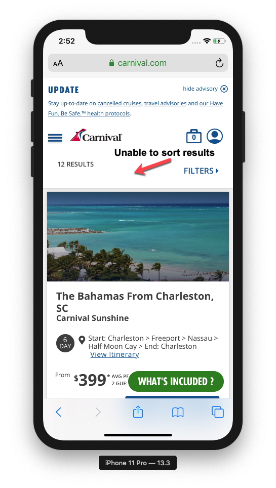

# Functional Tests Results

## Environment: Safari Version 14.1.2

 

| TestCase                   | Summary                                                                                                                      | Issues                                                                                                           |
| -------------------------- | ---------------------------------------------------------------------------------------------------------------------------- | ---------------------------------------------------------------------------------------------------------------- |
| Filter search by price     | Applying a filter to the slider works correctly.                                                                             | No issues found                                                                                                  |
| Sort search by price       | Acceptance criteria not met: "User can sort by price".                                                                       | A functionality must be added that allows the user to sort the results.                                          |
| Select sailing plan        | Is possible to check the itinerary for each day and the "Book now" button is displayed in the header and footer of the page. | No Issues found.                                                                                                 |
| Select staterooms quantity | The booking page is visible and is possible select the staterooms quantity.                                                  | No Issues found.                                                                                                 |
| Carnival Cruise Lines      | Acceptance criteria not met: "link must open a new tab with further instructions to proceed.".                               | Carnival Cruise Lines is visible but the link does not open another page, as defined in the acceptance criteria. |

## Environment: Chrome Version 93.0

 

| TestCase                   | Summary                                                                                                                      | Issues                                                                                                           |
| -------------------------- | -----------------------------------------------------------------                                                            | ---------------------------------------------------------------------------------------------------------        |
| Filter search by price     | Applying a filter to the slider works correctly.                                                                             | No issues found                                                                                                  |
| Sort search by price       | Acceptance criteria not met: "User can sort by price".                                                                       | A functionality must be added that allows the user to sort the results.                                          |
| Select sailing plan        | Is possible to check the itinerary for each day and the "Book now" button is displayed in the header and footer of the page. | No Issues found.                                                                                                 |
| Select staterooms quantity | The booking page is visible and is possible select the staterooms quantity.                                                  | No Issues found.                                                                                                 |
| Carnival Cruise Lines      | Acceptance criteria not met: "link must open a new tab with further instructions to proceed.".                               | Carnival Cruise Lines is visible but the link does not open another page, as defined in the acceptance criteria. |

## Environment: iOS 13.3 Safari Version 14.1.2

 

| TestCase                   | Summary                                                                                                                      | Issues                                                                                                       |
| -------------------------- | --------------------------------------------------------------------------------------------------------------------         | ------------------------------------------------------------------------------------------------------------ |
| Filter search by price     | Missing Search option                                                                                                        | The option "DURATION" is not visible in the search criteria.  Unable to filter by price.                     |
| Sort search by price       | Acceptance criteria not met: "User can sort by price".                                                                       | A functionality must be added that allows the user to sort the results.                                      |
| Select sailing plan        | Is possible to check the itinerary for each day and the "Book now" button is displayed in the header and footer of the page. | No Issues found.                                                                                             |
| Select staterooms quantity | The booking page is visible and is possible select the staterooms quantity.                                                  | No Issues found.                                                                                             |
| Carnival Cruise Lines      | Acceptance criteria not met: "link must open a new tab with further instructions to proceed.".                               | When the user tap on the links, a message is displayed informing that the URL is invalid                     |

## Bugs

Summary: Sort Option missing (Desktop, Mobile)

Scenario: Sort search by price

Description: Search results cannot be reorganized. The "sort" option is not available

Priority: Medium 

Story:UserStory#1

Attachments:

 

Summary: Carnival Cruise Lines link does not open another page (Desktop)

Scenario: Carnival Cruise Lines

Description: When the user tap on the links, a message is displayed informing that the URL is invalid.

Priority: Medium 

Story: UserStory#4

Attachments:

 

Summary: Carnival Cruise Lines link shows error message (Iphone)

Scenario: Carnival Cruise Lines

Description: The option for filter by pricing isn´t visible

Priority: Medium 

Story: UserStory#4

Attachments:

 

Summary: Unable to filter by price (Iphone)

Scenario: Filter search by price

Description: The option for filter by pricing isn´t visible

Priority: Medium 

Story: UserStory#1

Attachments:

 

Summary: Missing Option "Duration" (Iphone)

Scenario: Filter search by price

Description: The option for filter by pricing isn´t visible

Priority: Minor 

Story: UserStory#1

Attachments:

